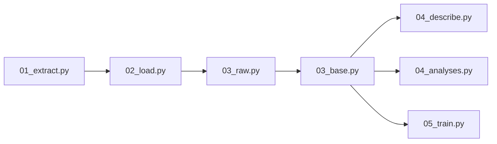

# Powerlifting ML Progress

[](https://github.com/astral-sh/ruff)
[](https://www.python.org)
[](https://github.com/namtonthat/powerlifting-ml-progress/actions/workflows/extract-transform-load.yml)
[](https://powerlifting.streamlit.app)


Analyzes [OpenPowerlifting](https://www.openpowerlifting.org/) data to estimate powerlifting progress over time using XGBoost. Includes an automated ETL pipeline, ML training with Optuna, MLflow tracking, and a [Streamlit dashboard](https://powerlifting.streamlit.app).

## Quick Start

```bash
# Setup environment
./scripts/setup.sh

# Download public data (no AWS creds needed)
./scripts/download-data.sh

# Run Streamlit dashboard
uv run streamlit run about.py
```

## Data Pipeline



Runs automatically via GitHub Actions on Tuesdays and Fridays. Data is public at `s3://powerlifting-ml-progress/`.

## Local Development

```bash
make setup          # Create venv, install deps, pre-commit
make start          # Start MinIO (ML artifact storage)
make stop           # Stop MinIO
```

**Run pipeline steps individually** (requires AWS credentials):

```bash
uv run python steps/01_extract.py   # Download OpenPowerlifting data
uv run python steps/02_load.py      # Upload reference tables to S3
uv run python steps/03_raw.py       # Raw layer transformations
uv run python steps/03_base.py      # Feature engineering
uv run python steps/04_describe.py  # Summary statistics
uv run python steps/04_analyses.py  # Advanced analytics
uv run python steps/05_train.py     # XGBoost training
```

**Analyse data locally** (no AWS credentials needed):

```bash
./scripts/download-data.sh           # Download public parquet files
uv run python                        # Then use polars to explore
```

```python
import polars as pl
df = pl.read_parquet("data/base/openpowerlifting-latest.parquet")
```
