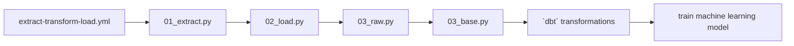

# 💪🏋️‍♂️ Powerlifting ML Progress

# :computer: Local Development

Refer to the `Makefile` using: `make` from the command line.
## :wrench: Setup
- `make setup` - creates a `virtualenv` and installs dependencies (via `pyenv` and `poetry` respectively) and then installs `precommit` for linting and code quality

# :gear: Data Model
Refer to `.github/workflows/*.yml` files.

Jobs are orchestrated by [`dagster`](https://github.com/dagster-io/dagster) with transformations done by `dbt`.

## 💡 Purpose

This repository analyzes publicly available data from the `OpenPowerlifting` database to estimate how much progress a powerlifter could make over time.

## 📊 Data

The data used in this repository is sourced from the `OpenPowerlifting` database, which contains information on powerlifting competitions, lifters, and their performances. You can download the necessary data from `s3://powerlifting-ml-progress/landing/openpowerlifting-latest.parquet` file.

##  References

- `OpenPowerlifting` database: [https://www.openpowerlifting.org/](https://www.openpowerlifting.org/)