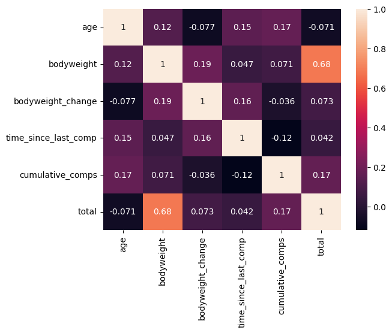

## ETL on `OpenPowerlifting` Data


```python
from IPython.display import display, Markdown
import polars as pl
from datetime import datetime as dt

# read configs
import sys
from pathlib import Path
sys.path.append(str(Path().resolve().parent))
from steps import conf
```

### Loading Data


```python
s3_file_path = f"https://{conf.bucket_name}.s3.ap-southeast-2.amazonaws.com/{conf.parquet_file}"

df = pl.read_parquet(s3_file_path)
df.head(5)
```


<div><style>
.dataframe > thead > tr > th,
.dataframe > tbody > tr > td {
  text-align: right;
}
</style>
<small>shape: (5, 41)</small><table border="1" class="dataframe"><thead><tr><th>Name</th><th>Sex</th><th>Event</th><th>Equipment</th><th>Age</th><th>AgeClass</th><th>BirthYearClass</th><th>Division</th><th>BodyweightKg</th><th>WeightClassKg</th><th>Squat1Kg</th><th>Squat2Kg</th><th>Squat3Kg</th><th>Squat4Kg</th><th>Best3SquatKg</th><th>Bench1Kg</th><th>Bench2Kg</th><th>Bench3Kg</th><th>Bench4Kg</th><th>Best3BenchKg</th><th>Deadlift1Kg</th><th>Deadlift2Kg</th><th>Deadlift3Kg</th><th>Deadlift4Kg</th><th>Best3DeadliftKg</th><th>TotalKg</th><th>Place</th><th>Dots</th><th>Wilks</th><th>Glossbrenner</th><th>Goodlift</th><th>Tested</th><th>Country</th><th>State</th><th>Federation</th><th>ParentFederation</th><th>Date</th><th>MeetCountry</th><th>MeetState</th><th>MeetTown</th><th>MeetName</th></tr><tr><td>str</td><td>str</td><td>str</td><td>str</td><td>f64</td><td>str</td><td>str</td><td>str</td><td>f64</td><td>str</td><td>f64</td><td>f64</td><td>f64</td><td>f64</td><td>f64</td><td>f64</td><td>f64</td><td>f64</td><td>f64</td><td>f64</td><td>f64</td><td>f64</td><td>f64</td><td>f64</td><td>f64</td><td>f64</td><td>str</td><td>f64</td><td>f64</td><td>f64</td><td>f64</td><td>str</td><td>str</td><td>str</td><td>str</td><td>str</td><td>str</td><td>str</td><td>str</td><td>str</td><td>str</td></tr></thead><tbody><tr><td>&quot;Alona Vladi&quot;</td><td>&quot;F&quot;</td><td>&quot;SBD&quot;</td><td>&quot;Raw&quot;</td><td>33.0</td><td>&quot;24-34&quot;</td><td>&quot;24-39&quot;</td><td>&quot;O&quot;</td><td>58.3</td><td>&quot;60&quot;</td><td>75.0</td><td>80.0</td><td>-90.0</td><td>null</td><td>80.0</td><td>50.0</td><td>55.0</td><td>60.0</td><td>null</td><td>60.0</td><td>95.0</td><td>105.0</td><td>107.5</td><td>null</td><td>107.5</td><td>247.5</td><td>&quot;1&quot;</td><td>279.44</td><td>282.18</td><td>249.42</td><td>57.1</td><td>&quot;Yes&quot;</td><td>&quot;Russia&quot;</td><td>null</td><td>&quot;GFP&quot;</td><td>null</td><td>&quot;2019-05-11&quot;</td><td>&quot;Russia&quot;</td><td>null</td><td>&quot;Bryansk&quot;</td><td>&quot;Open Tournamen…</td></tr><tr><td>&quot;Galina Solovya…</td><td>&quot;F&quot;</td><td>&quot;SBD&quot;</td><td>&quot;Raw&quot;</td><td>43.0</td><td>&quot;40-44&quot;</td><td>&quot;40-49&quot;</td><td>&quot;M1&quot;</td><td>73.1</td><td>&quot;75&quot;</td><td>95.0</td><td>100.0</td><td>105.0</td><td>null</td><td>105.0</td><td>62.5</td><td>67.5</td><td>-72.5</td><td>null</td><td>67.5</td><td>100.0</td><td>110.0</td><td>-120.0</td><td>null</td><td>110.0</td><td>282.5</td><td>&quot;1&quot;</td><td>278.95</td><td>272.99</td><td>240.35</td><td>56.76</td><td>&quot;Yes&quot;</td><td>&quot;Russia&quot;</td><td>null</td><td>&quot;GFP&quot;</td><td>null</td><td>&quot;2019-05-11&quot;</td><td>&quot;Russia&quot;</td><td>null</td><td>&quot;Bryansk&quot;</td><td>&quot;Open Tournamen…</td></tr><tr><td>&quot;Daniil Voronin…</td><td>&quot;M&quot;</td><td>&quot;SBD&quot;</td><td>&quot;Raw&quot;</td><td>15.5</td><td>&quot;16-17&quot;</td><td>&quot;14-18&quot;</td><td>&quot;T&quot;</td><td>67.4</td><td>&quot;75&quot;</td><td>85.0</td><td>90.0</td><td>100.0</td><td>null</td><td>100.0</td><td>55.0</td><td>62.5</td><td>-65.0</td><td>null</td><td>62.5</td><td>90.0</td><td>100.0</td><td>105.0</td><td>null</td><td>105.0</td><td>267.5</td><td>&quot;1&quot;</td><td>206.4</td><td>206.49</td><td>200.45</td><td>41.24</td><td>&quot;Yes&quot;</td><td>&quot;Russia&quot;</td><td>null</td><td>&quot;GFP&quot;</td><td>null</td><td>&quot;2019-05-11&quot;</td><td>&quot;Russia&quot;</td><td>null</td><td>&quot;Bryansk&quot;</td><td>&quot;Open Tournamen…</td></tr><tr><td>&quot;Aleksey Krasov…</td><td>&quot;M&quot;</td><td>&quot;SBD&quot;</td><td>&quot;Raw&quot;</td><td>35.0</td><td>&quot;35-39&quot;</td><td>&quot;24-39&quot;</td><td>&quot;O&quot;</td><td>66.65</td><td>&quot;75&quot;</td><td>125.0</td><td>132.0</td><td>137.5</td><td>null</td><td>137.5</td><td>115.0</td><td>122.5</td><td>-127.5</td><td>null</td><td>122.5</td><td>150.0</td><td>165.0</td><td>170.0</td><td>null</td><td>170.0</td><td>430.0</td><td>&quot;1&quot;</td><td>334.49</td><td>334.94</td><td>325.32</td><td>66.68</td><td>&quot;Yes&quot;</td><td>&quot;Russia&quot;</td><td>null</td><td>&quot;GFP&quot;</td><td>null</td><td>&quot;2019-05-11&quot;</td><td>&quot;Russia&quot;</td><td>null</td><td>&quot;Bryansk&quot;</td><td>&quot;Open Tournamen…</td></tr><tr><td>&quot;Margarita Ples…</td><td>&quot;M&quot;</td><td>&quot;SBD&quot;</td><td>&quot;Raw&quot;</td><td>26.5</td><td>&quot;24-34&quot;</td><td>&quot;24-39&quot;</td><td>&quot;O&quot;</td><td>72.45</td><td>&quot;75&quot;</td><td>80.0</td><td>85.0</td><td>90.0</td><td>null</td><td>90.0</td><td>40.0</td><td>50.0</td><td>-60.0</td><td>null</td><td>50.0</td><td>112.5</td><td>120.0</td><td>125.0</td><td>null</td><td>125.0</td><td>265.0</td><td>&quot;1&quot;</td><td>194.46</td><td>193.55</td><td>187.29</td><td>39.34</td><td>&quot;Yes&quot;</td><td>&quot;Russia&quot;</td><td>null</td><td>&quot;GFP&quot;</td><td>null</td><td>&quot;2019-05-11&quot;</td><td>&quot;Russia&quot;</td><td>null</td><td>&quot;Bryansk&quot;</td><td>&quot;Open Tournamen…</td></tr></tbody></table></div>


```python
cleansing_data_md = f"""
## Cleansing data
- Filter for only particular columns from {conf.op_cols}
    - Select events that are IPF / Tested federations only (i.e. `Tested` = "Yes")
    - Remove anyone who has been disqualified (i.e. `Place` = "DQ")
    - `raw` equipment events only (i.e. `equipment` = `Raw`, single ply and wraps have 'competitive' advantage and are typically only for advanced lifters)
- Drop any rows that have missing values in the columns above.
- Drop any duplicates based on all columns.
"""

display(Markdown(cleansing_data_md))
```


## Cleansing data
- Filter for only particular columns from ['Date', 'Name', 'Sex', 'Place', 'Age', 'AgeClass', 'BodyweightKg', 'Event', 'MeetCountry', 'Equipment', 'Best3SquatKg', 'Best3BenchKg', 'Best3DeadliftKg', 'TotalKg', 'Wilks', 'Tested', 'Federation', 'MeetName']
    - Select events that are IPF / Tested federations only (i.e. `Tested` = "Yes")
    - Remove anyone who has been disqualified (i.e. `Place` = "DQ")
    - `raw` equipment events only (i.e. `equipment` = `Raw`, single ply and wraps have 'competitive' advantage and are typically only for advanced lifters)
- Drop any rows that have missing values in the columns above.
- Drop any duplicates based on all columns.


```python
base_df = df.select(conf.op_cols)
print(base_df.shape)
base_df.head(5)
```

    (2907777, 18)


<div><style>
.dataframe > thead > tr > th,
.dataframe > tbody > tr > td {
  text-align: right;
}
</style>
<small>shape: (5, 18)</small><table border="1" class="dataframe"><thead><tr><th>Date</th><th>Name</th><th>Sex</th><th>Place</th><th>Age</th><th>AgeClass</th><th>BodyweightKg</th><th>Event</th><th>MeetCountry</th><th>Equipment</th><th>Best3SquatKg</th><th>Best3BenchKg</th><th>Best3DeadliftKg</th><th>TotalKg</th><th>Wilks</th><th>Tested</th><th>Federation</th><th>MeetName</th></tr><tr><td>str</td><td>str</td><td>str</td><td>str</td><td>f64</td><td>str</td><td>f64</td><td>str</td><td>str</td><td>str</td><td>f64</td><td>f64</td><td>f64</td><td>f64</td><td>f64</td><td>str</td><td>str</td><td>str</td></tr></thead><tbody><tr><td>&quot;2019-05-11&quot;</td><td>&quot;Alona Vladi&quot;</td><td>&quot;F&quot;</td><td>&quot;1&quot;</td><td>33.0</td><td>&quot;24-34&quot;</td><td>58.3</td><td>&quot;SBD&quot;</td><td>&quot;Russia&quot;</td><td>&quot;Raw&quot;</td><td>80.0</td><td>60.0</td><td>107.5</td><td>247.5</td><td>282.18</td><td>&quot;Yes&quot;</td><td>&quot;GFP&quot;</td><td>&quot;Open Tournamen…</td></tr><tr><td>&quot;2019-05-11&quot;</td><td>&quot;Galina Solovya…</td><td>&quot;F&quot;</td><td>&quot;1&quot;</td><td>43.0</td><td>&quot;40-44&quot;</td><td>73.1</td><td>&quot;SBD&quot;</td><td>&quot;Russia&quot;</td><td>&quot;Raw&quot;</td><td>105.0</td><td>67.5</td><td>110.0</td><td>282.5</td><td>272.99</td><td>&quot;Yes&quot;</td><td>&quot;GFP&quot;</td><td>&quot;Open Tournamen…</td></tr><tr><td>&quot;2019-05-11&quot;</td><td>&quot;Daniil Voronin…</td><td>&quot;M&quot;</td><td>&quot;1&quot;</td><td>15.5</td><td>&quot;16-17&quot;</td><td>67.4</td><td>&quot;SBD&quot;</td><td>&quot;Russia&quot;</td><td>&quot;Raw&quot;</td><td>100.0</td><td>62.5</td><td>105.0</td><td>267.5</td><td>206.49</td><td>&quot;Yes&quot;</td><td>&quot;GFP&quot;</td><td>&quot;Open Tournamen…</td></tr><tr><td>&quot;2019-05-11&quot;</td><td>&quot;Aleksey Krasov…</td><td>&quot;M&quot;</td><td>&quot;1&quot;</td><td>35.0</td><td>&quot;35-39&quot;</td><td>66.65</td><td>&quot;SBD&quot;</td><td>&quot;Russia&quot;</td><td>&quot;Raw&quot;</td><td>137.5</td><td>122.5</td><td>170.0</td><td>430.0</td><td>334.94</td><td>&quot;Yes&quot;</td><td>&quot;GFP&quot;</td><td>&quot;Open Tournamen…</td></tr><tr><td>&quot;2019-05-11&quot;</td><td>&quot;Margarita Ples…</td><td>&quot;M&quot;</td><td>&quot;1&quot;</td><td>26.5</td><td>&quot;24-34&quot;</td><td>72.45</td><td>&quot;SBD&quot;</td><td>&quot;Russia&quot;</td><td>&quot;Raw&quot;</td><td>90.0</td><td>50.0</td><td>125.0</td><td>265.0</td><td>193.55</td><td>&quot;Yes&quot;</td><td>&quot;GFP&quot;</td><td>&quot;Open Tournamen…</td></tr></tbody></table></div>


```python
cleansed_df = base_df.filter(
    (pl.col("Event") == "SBD") &
    (pl.col("Tested") == "Yes") &
    (pl.col('Place').apply(lambda x: x.isnumeric(), return_dtype = pl.Boolean)) &
    (pl.col("Equipment") == "Raw")
).drop_nulls().unique().sort("Date", descending=True).drop(["Tested", "Federation", "Event"])
print(cleansed_df.shape)
cleansed_df.head(5)
```

    (429429, 15)


<div><style>
.dataframe > thead > tr > th,
.dataframe > tbody > tr > td {
  text-align: right;
}
</style>
<small>shape: (5, 15)</small><table border="1" class="dataframe"><thead><tr><th>Date</th><th>Name</th><th>Sex</th><th>Place</th><th>Age</th><th>AgeClass</th><th>BodyweightKg</th><th>MeetCountry</th><th>Equipment</th><th>Best3SquatKg</th><th>Best3BenchKg</th><th>Best3DeadliftKg</th><th>TotalKg</th><th>Wilks</th><th>MeetName</th></tr><tr><td>str</td><td>str</td><td>str</td><td>str</td><td>f64</td><td>str</td><td>f64</td><td>str</td><td>str</td><td>f64</td><td>f64</td><td>f64</td><td>f64</td><td>f64</td><td>str</td></tr></thead><tbody><tr><td>&quot;2023-05-07&quot;</td><td>&quot;Sandrine Genou…</td><td>&quot;F&quot;</td><td>&quot;1&quot;</td><td>35.0</td><td>&quot;35-39&quot;</td><td>48.5</td><td>&quot;Switzerland&quot;</td><td>&quot;Raw&quot;</td><td>100.0</td><td>50.0</td><td>117.5</td><td>267.5</td><td>351.58</td><td>&quot;Championnat Su…</td></tr><tr><td>&quot;2023-05-07&quot;</td><td>&quot;Laura Delay&quot;</td><td>&quot;F&quot;</td><td>&quot;2&quot;</td><td>25.0</td><td>&quot;24-34&quot;</td><td>50.3</td><td>&quot;Switzerland&quot;</td><td>&quot;Raw&quot;</td><td>95.0</td><td>55.0</td><td>110.0</td><td>260.0</td><td>332.49</td><td>&quot;Championnat Su…</td></tr><tr><td>&quot;2023-05-07&quot;</td><td>&quot;Selin Tabak&quot;</td><td>&quot;F&quot;</td><td>&quot;1&quot;</td><td>25.0</td><td>&quot;24-34&quot;</td><td>56.4</td><td>&quot;Switzerland&quot;</td><td>&quot;Raw&quot;</td><td>120.0</td><td>70.0</td><td>130.0</td><td>320.0</td><td>374.42</td><td>&quot;Championnat Su…</td></tr><tr><td>&quot;2023-05-07&quot;</td><td>&quot;Célestine Nguy…</td><td>&quot;F&quot;</td><td>&quot;1&quot;</td><td>29.0</td><td>&quot;24-34&quot;</td><td>62.0</td><td>&quot;Switzerland&quot;</td><td>&quot;Raw&quot;</td><td>110.0</td><td>42.5</td><td>132.5</td><td>285.0</td><td>309.82</td><td>&quot;Championnat Su…</td></tr><tr><td>&quot;2023-05-07&quot;</td><td>&quot;Daniela Niklau…</td><td>&quot;F&quot;</td><td>&quot;1&quot;</td><td>37.0</td><td>&quot;35-39&quot;</td><td>66.5</td><td>&quot;Switzerland&quot;</td><td>&quot;Raw&quot;</td><td>112.5</td><td>82.5</td><td>165.0</td><td>360.0</td><td>371.4</td><td>&quot;Championnat Su…</td></tr></tbody></table></div>


```python
cleansed_df.filter(pl.col("Name") == "John Paul Cauchi").sort("Date", descending=True).head(5)
```


<div><style>
.dataframe > thead > tr > th,
.dataframe > tbody > tr > td {
  text-align: right;
}
</style>
<small>shape: (5, 15)</small><table border="1" class="dataframe"><thead><tr><th>Date</th><th>Name</th><th>Sex</th><th>Place</th><th>Age</th><th>AgeClass</th><th>BodyweightKg</th><th>MeetCountry</th><th>Equipment</th><th>Best3SquatKg</th><th>Best3BenchKg</th><th>Best3DeadliftKg</th><th>TotalKg</th><th>Wilks</th><th>MeetName</th></tr><tr><td>str</td><td>str</td><td>str</td><td>str</td><td>f64</td><td>str</td><td>f64</td><td>str</td><td>str</td><td>f64</td><td>f64</td><td>f64</td><td>f64</td><td>f64</td><td>str</td></tr></thead><tbody><tr><td>&quot;2022-11-05&quot;</td><td>&quot;John Paul Cauc…</td><td>&quot;M&quot;</td><td>&quot;1&quot;</td><td>29.5</td><td>&quot;24-34&quot;</td><td>82.35</td><td>&quot;Australia&quot;</td><td>&quot;Raw&quot;</td><td>265.0</td><td>137.5</td><td>290.0</td><td>692.5</td><td>464.42</td><td>&quot;Ballarat Open&quot;</td></tr><tr><td>&quot;2021-04-11&quot;</td><td>&quot;John Paul Cauc…</td><td>&quot;M&quot;</td><td>&quot;1&quot;</td><td>28.0</td><td>&quot;24-34&quot;</td><td>76.75</td><td>&quot;Australia&quot;</td><td>&quot;Raw&quot;</td><td>260.0</td><td>138.0</td><td>290.0</td><td>688.0</td><td>482.56</td><td>&quot;JPS Open VII&quot;</td></tr><tr><td>&quot;2020-09-26&quot;</td><td>&quot;John Paul Cauc…</td><td>&quot;M&quot;</td><td>&quot;2&quot;</td><td>27.5</td><td>&quot;24-34&quot;</td><td>76.95</td><td>&quot;Australia&quot;</td><td>&quot;Raw&quot;</td><td>256.0</td><td>133.0</td><td>306.0</td><td>695.0</td><td>486.62</td><td>&quot;Australian Pow…</td></tr><tr><td>&quot;2019-08-22&quot;</td><td>&quot;John Paul Cauc…</td><td>&quot;M&quot;</td><td>&quot;2&quot;</td><td>26.5</td><td>&quot;24-34&quot;</td><td>76.9</td><td>&quot;China&quot;</td><td>&quot;Raw&quot;</td><td>248.0</td><td>135.0</td><td>273.0</td><td>656.0</td><td>459.52</td><td>&quot;Asia Pacific O…</td></tr><tr><td>&quot;2019-06-28&quot;</td><td>&quot;John Paul Cauc…</td><td>&quot;M&quot;</td><td>&quot;1&quot;</td><td>26.5</td><td>&quot;24-34&quot;</td><td>76.85</td><td>&quot;Australia&quot;</td><td>&quot;Raw&quot;</td><td>253.0</td><td>134.0</td><td>286.0</td><td>673.0</td><td>471.63</td><td>&quot;Australian Pow…</td></tr></tbody></table></div>


## Data Preparation
- Drop the `Tested`, `Federation` and `Event` columns as they are no longer needed.
- Update column types:
    - `Date` to `Date`
    - `Place` to `Int64`
- Collect data from 2000-01-01 onwards.
- Rename columns from camel to snake case
- Assume that a powerlifter's country is from the first country that compete in.


```python
# find the first country that the powerlifter competed in and assume that is their country of origin
lifter_country_df = cleansed_df.groupby(["Name", "Sex"]).agg(pl.first("MeetCountry").alias("OriginCountry"))
```


```python
data_prep_df = cleansed_df.sort(["Name", "Date"], descending=[False, True]).join(lifter_country_df, on=["Name", "Sex"]).filter(pl.col("Date").gt("2000-01-01")).with_columns(
    pl.col("Date").str.strptime(pl.Date, fmt="%Y-%m-%d").alias("Date"),
    pl.col("Place").cast(pl.Int32).alias("Place"),
).rename(
    mapping=conf.op_cols_rename
).select(
    pl.all().map_alias(lambda col_name: conf.camel_to_snake(col_name))
)


print(data_prep_df.shape)
data_prep_df.head(5)
```

    (428601, 16)


<div><style>
.dataframe > thead > tr > th,
.dataframe > tbody > tr > td {
  text-align: right;
}
</style>
<small>shape: (5, 16)</small><table border="1" class="dataframe"><thead><tr><th>date</th><th>name</th><th>sex</th><th>place</th><th>age</th><th>age_class</th><th>bodyweight</th><th>meet_country</th><th>equipment</th><th>squat</th><th>bench</th><th>deadlift</th><th>total</th><th>wilks</th><th>meet_name</th><th>origin_country</th></tr><tr><td>date</td><td>str</td><td>str</td><td>i32</td><td>f64</td><td>str</td><td>f64</td><td>str</td><td>str</td><td>f64</td><td>f64</td><td>f64</td><td>f64</td><td>f64</td><td>str</td><td>str</td></tr></thead><tbody><tr><td>2017-12-04</td><td>&quot;A Ajeesha&quot;</td><td>&quot;F&quot;</td><td>1</td><td>16.5</td><td>&quot;16-17&quot;</td><td>71.1</td><td>&quot;India&quot;</td><td>&quot;Raw&quot;</td><td>112.5</td><td>55.0</td><td>132.5</td><td>300.0</td><td>295.29</td><td>&quot;Asian Classic …</td><td>&quot;India&quot;</td></tr><tr><td>2012-12-10</td><td>&quot;A Ashwin&quot;</td><td>&quot;M&quot;</td><td>1</td><td>16.5</td><td>&quot;16-17&quot;</td><td>82.55</td><td>&quot;India&quot;</td><td>&quot;Raw&quot;</td><td>170.0</td><td>95.0</td><td>220.0</td><td>485.0</td><td>324.79</td><td>&quot;Asian Classic …</td><td>&quot;India&quot;</td></tr><tr><td>2019-10-01</td><td>&quot;A Belousov&quot;</td><td>&quot;M&quot;</td><td>8</td><td>17.5</td><td>&quot;18-19&quot;</td><td>73.6</td><td>&quot;Kazakhstan&quot;</td><td>&quot;Raw&quot;</td><td>75.0</td><td>75.0</td><td>100.0</td><td>250.0</td><td>180.52</td><td>&quot;Kazakhstan Cla…</td><td>&quot;Kazakhstan&quot;</td></tr><tr><td>2019-09-26</td><td>&quot;A K S Shri Ram…</td><td>&quot;M&quot;</td><td>13</td><td>16.0</td><td>&quot;16-17&quot;</td><td>78.2</td><td>&quot;India&quot;</td><td>&quot;Raw&quot;</td><td>117.5</td><td>50.0</td><td>150.0</td><td>317.5</td><td>219.95</td><td>&quot;Indian Classic…</td><td>&quot;India&quot;</td></tr><tr><td>2019-09-26</td><td>&quot;A Pradeep&quot;</td><td>&quot;M&quot;</td><td>6</td><td>17.0</td><td>&quot;16-17&quot;</td><td>80.7</td><td>&quot;India&quot;</td><td>&quot;Raw&quot;</td><td>150.0</td><td>97.5</td><td>170.0</td><td>417.5</td><td>283.48</td><td>&quot;Indian Classic…</td><td>&quot;India&quot;</td></tr></tbody></table></div>


### Feature Engineering
#### Creating a Primary Key

- As we require to track a lifter's progress over time,  the problem we'll encounter is that there is no primary key to define the dataset without a lifter's birth date.
- This could have been resolved if we had their birth date but in lieu of this, we can derive their age assuming that everyone's birthday is the start of each year.
- The only problem that this would result in is that we have two lifters of the same name with the same age (actually likely) but not as  like as the first scenario.

A new dataframe is created called `primary_key_df` to generate this `primary_key` column

#### Columns added
- Create a `pot_*` (progress over time) columns for `wilks` and `total`
- Adds columns:
  - `time_since_last_comp`: identify how long it has been since their last competition (in days)
  - `home_country`: 1 if `meet_country` == `origin_country` else 0
  - `bodyweight_change`: change in bodyweight since the last comp (in kg)
  - `cumulative_comps`: running total of the number of comopetitions completed
  - `meet_type`: categories each meet in `local`, `national` or `international`
  - `starting lifts`: defines their starting lifts
- Switches `Date` to ordinal as a new column `date_ass_ordinal`


```python
primary_key_df = data_prep_df.with_columns(
    (pl.col("date").dt.strftime('%Y').cast(pl.Int32) - pl.col("age")).cast(pl.Int32).cast(pl.Utf8).alias("year_of_birth")).with_columns(
     pl.concat_str([pl.col('year_of_birth'), pl.lit("01-01")], separator="-").str.strptime(pl.Date, fmt="%Y-%m-%d").alias("date_of_birth")).with_columns(
     pl.concat_str([pl.col('name').str.to_lowercase().str.replace(' ', pl.lit('-')), pl.col("date_of_birth")], separator="-").alias('primary_key')).unique(subset=["primary_key", "date", "meet_name"]).drop(["date_of_birth"])
primary_key_df.head(2)
```


<div><style>
.dataframe > thead > tr > th,
.dataframe > tbody > tr > td {
  text-align: right;
}
</style>
<small>shape: (2, 18)</small><table border="1" class="dataframe"><thead><tr><th>date</th><th>name</th><th>sex</th><th>place</th><th>age</th><th>age_class</th><th>bodyweight</th><th>meet_country</th><th>equipment</th><th>squat</th><th>bench</th><th>deadlift</th><th>total</th><th>wilks</th><th>meet_name</th><th>origin_country</th><th>year_of_birth</th><th>primary_key</th></tr><tr><td>date</td><td>str</td><td>str</td><td>i32</td><td>f64</td><td>str</td><td>f64</td><td>str</td><td>str</td><td>f64</td><td>f64</td><td>f64</td><td>f64</td><td>f64</td><td>str</td><td>str</td><td>str</td><td>str</td></tr></thead><tbody><tr><td>2017-12-04</td><td>&quot;A Ajeesha&quot;</td><td>&quot;F&quot;</td><td>1</td><td>16.5</td><td>&quot;16-17&quot;</td><td>71.1</td><td>&quot;India&quot;</td><td>&quot;Raw&quot;</td><td>112.5</td><td>55.0</td><td>132.5</td><td>300.0</td><td>295.29</td><td>&quot;Asian Classic …</td><td>&quot;India&quot;</td><td>&quot;2000&quot;</td><td>&quot;a-ajeesha-2000…</td></tr><tr><td>2012-12-10</td><td>&quot;A Ashwin&quot;</td><td>&quot;M&quot;</td><td>1</td><td>16.5</td><td>&quot;16-17&quot;</td><td>82.55</td><td>&quot;India&quot;</td><td>&quot;Raw&quot;</td><td>170.0</td><td>95.0</td><td>220.0</td><td>485.0</td><td>324.79</td><td>&quot;Asian Classic …</td><td>&quot;India&quot;</td><td>&quot;1995&quot;</td><td>&quot;a-ashwin-1995-…</td></tr></tbody></table></div>


```python
fe_df = primary_key_df.with_columns(
     (pl.col('date') - pl.col('date').shift(-1)).over('primary_key').alias('time_since_last_comp').apply(lambda x: x.days).cast(pl.Int32),
     (pl.col('bodyweight') - pl.col('bodyweight').shift(-1)).over('primary_key').alias('bodyweight_change').cast(pl.Float64),
).sort(
    ["name", "date"], descending=[False, False]
).with_columns(
    (pl.col('time_since_last_comp') / 365.25).alias('years_since_last_comp'),
    (pl.col("meet_country") == pl.col("origin_country")).alias("is_origin_country"),
    pl.col('date').apply(lambda x: x.toordinal()).alias('date_as_ordinal'),
    pl.col('name').cumcount().over('primary_key').alias('cumulative_comps'),
    pl.when(
        pl.col("meet_name").str.contains('national')
    ).then("national").otherwise(
    pl.when(
        pl.col('meet_name').str.contains('International|World|Commonwealth')
    ).then("international").otherwise("local")).alias('meet_type'),
).filter(
    pl.col('time_since_last_comp') !=  0
)

# have to filter out the time_since_last_comp since there might be data entry handling error


fe_df = fe_df.with_columns(
    ((pl.col('squat') - pl.col('squat').shift(1)) / pl.col('years_since_last_comp')).over('primary_key').alias(f'squat_progress'),
    ((pl.col('bench') - pl.col('bench').shift(1)) / pl.col('years_since_last_comp')).over('primary_key').alias(f'bench_progress'),
    ((pl.col('deadlift') - pl.col('deadlift').shift(1)) / pl.col('years_since_last_comp')).over('primary_key').alias(f'deadlift_progress'),
    ((pl.col('total') - pl.col('total').shift(1)) / pl.col('years_since_last_comp')).over('primary_key').alias(f'total_progress'),
    ((pl.col('wilks') - pl.col('wilks').shift(1)) / pl.col('years_since_last_comp')).over('primary_key').alias(f'wilks_progress')
).drop_nulls()
```


```python
fe_df.filter(pl.col("name").str.starts_with('Dmitriy Markov')).sort("date", descending=True).select(fe_df.columns[:25])
```


<div><style>
.dataframe > thead > tr > th,
.dataframe > tbody > tr > td {
  text-align: right;
}
</style>
<small>shape: (4, 25)</small><table border="1" class="dataframe"><thead><tr><th>date</th><th>name</th><th>sex</th><th>place</th><th>age</th><th>age_class</th><th>bodyweight</th><th>meet_country</th><th>equipment</th><th>squat</th><th>bench</th><th>deadlift</th><th>total</th><th>wilks</th><th>meet_name</th><th>origin_country</th><th>year_of_birth</th><th>primary_key</th><th>time_since_last_comp</th><th>bodyweight_change</th><th>years_since_last_comp</th><th>is_origin_country</th><th>date_as_ordinal</th><th>cumulative_comps</th><th>meet_type</th></tr><tr><td>date</td><td>str</td><td>str</td><td>i32</td><td>f64</td><td>str</td><td>f64</td><td>str</td><td>str</td><td>f64</td><td>f64</td><td>f64</td><td>f64</td><td>f64</td><td>str</td><td>str</td><td>str</td><td>str</td><td>i32</td><td>f64</td><td>f64</td><td>bool</td><td>i64</td><td>u32</td><td>str</td></tr></thead><tbody><tr><td>2021-02-19</td><td>&quot;Dmitriy Markov…</td><td>&quot;M&quot;</td><td>8</td><td>16.5</td><td>&quot;16-17&quot;</td><td>78.3</td><td>&quot;Russia&quot;</td><td>&quot;Raw&quot;</td><td>127.5</td><td>77.5</td><td>147.5</td><td>352.5</td><td>243.99</td><td>&quot;Nizhny Novgoro…</td><td>&quot;Russia&quot;</td><td>&quot;2004&quot;</td><td>&quot;dmitriy-markov…</td><td>370</td><td>8.95</td><td>1.013005</td><td>true</td><td>737840</td><td>3</td><td>&quot;local&quot;</td></tr><tr><td>2020-02-15</td><td>&quot;Dmitriy Markov…</td><td>&quot;M&quot;</td><td>8</td><td>15.5</td><td>&quot;16-17&quot;</td><td>69.35</td><td>&quot;Russia&quot;</td><td>&quot;Raw&quot;</td><td>120.0</td><td>65.0</td><td>137.5</td><td>322.5</td><td>243.42</td><td>&quot;Nizhny Novgoro…</td><td>&quot;Russia&quot;</td><td>&quot;2004&quot;</td><td>&quot;dmitriy-markov…</td><td>161</td><td>3.7</td><td>0.440794</td><td>true</td><td>737470</td><td>2</td><td>&quot;local&quot;</td></tr><tr><td>2019-09-07</td><td>&quot;Dmitriy Markov…</td><td>&quot;M&quot;</td><td>5</td><td>14.5</td><td>&quot;13-15&quot;</td><td>65.65</td><td>&quot;Russia&quot;</td><td>&quot;Raw&quot;</td><td>105.0</td><td>55.0</td><td>120.0</td><td>280.0</td><td>220.82</td><td>&quot;Nizhny Novgoro…</td><td>&quot;Russia&quot;</td><td>&quot;2004&quot;</td><td>&quot;dmitriy-markov…</td><td>127</td><td>0.65</td><td>0.347707</td><td>true</td><td>737309</td><td>1</td><td>&quot;local&quot;</td></tr><tr><td>2016-04-20</td><td>&quot;Dmitriy Markov…</td><td>&quot;M&quot;</td><td>13</td><td>18.5</td><td>&quot;18-19&quot;</td><td>79.9</td><td>&quot;Belarus&quot;</td><td>&quot;Raw&quot;</td><td>155.0</td><td>107.5</td><td>210.0</td><td>472.5</td><td>322.83</td><td>&quot;Belarus Studen…</td><td>&quot;Belarus&quot;</td><td>&quot;1997&quot;</td><td>&quot;dmitriy-markov…</td><td>468</td><td>-1.16</td><td>1.281314</td><td>true</td><td>736074</td><td>1</td><td>&quot;local&quot;</td></tr></tbody></table></div>


```python
fe_df.sort(by=['bench_progress'], reverse=True).select(fe_df.columns[:30])
```

    /var/folders/n1/f6ysz_js0qg8xpr_dzb94mjh0000gn/T/ipykernel_83249/3986157213.py:1: DeprecationWarning: `reverse` is deprecated as an argument to `sort`; use `descending` instead.
      fe_df.sort(by=['bench_progress'], reverse=True).select(fe_df.columns[:30])


<div><style>
.dataframe > thead > tr > th,
.dataframe > tbody > tr > td {
  text-align: right;
}
</style>
<small>shape: (213364, 30)</small><table border="1" class="dataframe"><thead><tr><th>date</th><th>name</th><th>sex</th><th>place</th><th>age</th><th>age_class</th><th>bodyweight</th><th>meet_country</th><th>equipment</th><th>squat</th><th>bench</th><th>deadlift</th><th>total</th><th>wilks</th><th>meet_name</th><th>origin_country</th><th>year_of_birth</th><th>primary_key</th><th>time_since_last_comp</th><th>bodyweight_change</th><th>years_since_last_comp</th><th>is_origin_country</th><th>date_as_ordinal</th><th>cumulative_comps</th><th>meet_type</th><th>squat_progress</th><th>bench_progress</th><th>deadlift_progress</th><th>total_progress</th><th>wilks_progress</th></tr><tr><td>date</td><td>str</td><td>str</td><td>i32</td><td>f64</td><td>str</td><td>f64</td><td>str</td><td>str</td><td>f64</td><td>f64</td><td>f64</td><td>f64</td><td>f64</td><td>str</td><td>str</td><td>str</td><td>str</td><td>i32</td><td>f64</td><td>f64</td><td>bool</td><td>i64</td><td>u32</td><td>str</td><td>f64</td><td>f64</td><td>f64</td><td>f64</td><td>f64</td></tr></thead><tbody><tr><td>2022-03-05</td><td>&quot;Anna Kubek&quot;</td><td>&quot;F&quot;</td><td>1</td><td>26.0</td><td>&quot;24-34&quot;</td><td>65.15</td><td>&quot;USA&quot;</td><td>&quot;Raw&quot;</td><td>132.5</td><td>80.0</td><td>165.0</td><td>377.5</td><td>395.36</td><td>&quot;Utah State Cha…</td><td>&quot;USA&quot;</td><td>&quot;1996&quot;</td><td>&quot;anna-kubek-199…</td><td>1</td><td>-0.65</td><td>0.002738</td><td>true</td><td>738219</td><td>1</td><td>&quot;local&quot;</td><td>18262.5</td><td>9131.25</td><td>22828.125</td><td>50221.875</td><td>53268.06</td></tr><tr><td>2022-08-28</td><td>&quot;Matyas Gruszka…</td><td>&quot;M&quot;</td><td>1</td><td>17.5</td><td>&quot;18-19&quot;</td><td>64.8</td><td>&quot;Czechia&quot;</td><td>&quot;Raw&quot;</td><td>162.5</td><td>115.0</td><td>180.0</td><td>457.5</td><td>364.74</td><td>&quot;Mistrovství Mo…</td><td>&quot;Poland&quot;</td><td>&quot;2004&quot;</td><td>&quot;matyas-gruszka…</td><td>1</td><td>-1.2</td><td>0.002738</td><td>false</td><td>738395</td><td>1</td><td>&quot;local&quot;</td><td>11870.625</td><td>6391.875</td><td>5478.75</td><td>23741.25</td><td>20654.8875</td></tr><tr><td>2022-10-16</td><td>&quot;Jan Gazur&quot;</td><td>&quot;M&quot;</td><td>1</td><td>17.5</td><td>&quot;18-19&quot;</td><td>64.65</td><td>&quot;Czechia&quot;</td><td>&quot;Raw&quot;</td><td>160.0</td><td>105.0</td><td>200.0</td><td>465.0</td><td>371.45</td><td>&quot;Mistrovství Če…</td><td>&quot;Czechia&quot;</td><td>&quot;2004&quot;</td><td>&quot;jan-gazur-2004…</td><td>1</td><td>-0.3</td><td>0.002738</td><td>true</td><td>738444</td><td>3</td><td>&quot;local&quot;</td><td>18262.5</td><td>5478.75</td><td>25567.5</td><td>49308.75</td><td>39761.115</td></tr><tr><td>2022-10-16</td><td>&quot;Matyas Gruszka…</td><td>&quot;M&quot;</td><td>2</td><td>17.5</td><td>&quot;18-19&quot;</td><td>65.5</td><td>&quot;Czechia&quot;</td><td>&quot;Raw&quot;</td><td>150.0</td><td>112.5</td><td>195.0</td><td>457.5</td><td>361.49</td><td>&quot;Mistrovství Če…</td><td>&quot;Poland&quot;</td><td>&quot;2004&quot;</td><td>&quot;matyas-gruszka…</td><td>1</td><td>-0.25</td><td>0.002738</td><td>false</td><td>738444</td><td>4</td><td>&quot;local&quot;</td><td>7305.0</td><td>4565.625</td><td>23741.25</td><td>35611.875</td><td>28463.9325</td></tr><tr><td>2019-06-27</td><td>&quot;Piotr Jabłonsk…</td><td>&quot;M&quot;</td><td>6</td><td>27.5</td><td>&quot;24-34&quot;</td><td>79.25</td><td>&quot;Sweden&quot;</td><td>&quot;Raw&quot;</td><td>235.0</td><td>182.5</td><td>240.0</td><td>657.5</td><td>451.57</td><td>&quot;SM Klassisk St…</td><td>&quot;Sweden&quot;</td><td>&quot;1991&quot;</td><td>&quot;piotr-jabłonsk…</td><td>4</td><td>6.0</td><td>0.010951</td><td>true</td><td>737237</td><td>7</td><td>&quot;local&quot;</td><td>5022.1875</td><td>4337.34375</td><td>456.5625</td><td>9816.09375</td><td>4845.04125</td></tr><tr><td>2022-03-23</td><td>&quot;Mason Mitchell…</td><td>&quot;M&quot;</td><td>1</td><td>17.5</td><td>&quot;18-19&quot;</td><td>92.71</td><td>&quot;USA&quot;</td><td>&quot;Raw&quot;</td><td>227.5</td><td>170.0</td><td>260.0</td><td>657.5</td><td>413.65</td><td>&quot;Teen Nationals…</td><td>&quot;USA&quot;</td><td>&quot;2004&quot;</td><td>&quot;mason-mitchell…</td><td>1</td><td>3.37</td><td>0.002738</td><td>true</td><td>738237</td><td>6</td><td>&quot;local&quot;</td><td>-2739.375</td><td>3652.5</td><td>-2739.375</td><td>-1826.25</td><td>-3973.92</td></tr><tr><td>2022-10-16</td><td>&quot;Simon Barčiš&quot;</td><td>&quot;M&quot;</td><td>1</td><td>17.5</td><td>&quot;18-19&quot;</td><td>58.35</td><td>&quot;Czechia&quot;</td><td>&quot;Raw&quot;</td><td>105.0</td><td>80.0</td><td>162.5</td><td>347.5</td><td>304.13</td><td>&quot;Mistrovství Če…</td><td>&quot;Czechia&quot;</td><td>&quot;2004&quot;</td><td>&quot;simon-barčiš-2…</td><td>1</td><td>0.3</td><td>0.002738</td><td>true</td><td>738444</td><td>4</td><td>&quot;local&quot;</td><td>5478.75</td><td>3652.5</td><td>15523.125</td><td>24654.375</td><td>21144.3225</td></tr><tr><td>2022-03-23</td><td>&quot;Clark Whitefie…</td><td>&quot;M&quot;</td><td>2</td><td>17.0</td><td>&quot;16-17&quot;</td><td>73.07</td><td>&quot;USA&quot;</td><td>&quot;Raw&quot;</td><td>220.0</td><td>150.0</td><td>225.0</td><td>595.0</td><td>431.88</td><td>&quot;Teen Nationals…</td><td>&quot;Turkey&quot;</td><td>&quot;2005&quot;</td><td>&quot;clark-whitefie…</td><td>1</td><td>-0.77</td><td>0.002738</td><td>false</td><td>738237</td><td>2</td><td>&quot;local&quot;</td><td>1826.25</td><td>2739.375</td><td>913.125</td><td>5478.75</td><td>5128.11</td></tr><tr><td>2015-05-22</td><td>&quot;Artur Zheltukh…</td><td>&quot;M&quot;</td><td>3</td><td>23.5</td><td>&quot;24-34&quot;</td><td>100.6</td><td>&quot;Russia&quot;</td><td>&quot;Raw&quot;</td><td>227.5</td><td>162.5</td><td>220.0</td><td>610.0</td><td>370.36</td><td>&quot;Irkutsk Powerl…</td><td>&quot;Russia&quot;</td><td>&quot;1991&quot;</td><td>&quot;artur-zheltukh…</td><td>5</td><td>10.4</td><td>0.013689</td><td>true</td><td>735740</td><td>2</td><td>&quot;local&quot;</td><td>4565.625</td><td>2556.75</td><td>4017.75</td><td>11140.125</td><td>5743.191</td></tr><tr><td>2020-03-07</td><td>&quot;Aleksandr Skvo…</td><td>&quot;M&quot;</td><td>1</td><td>16.0</td><td>&quot;16-17&quot;</td><td>66.4</td><td>&quot;Russia&quot;</td><td>&quot;Raw&quot;</td><td>120.0</td><td>90.0</td><td>170.0</td><td>380.0</td><td>296.9</td><td>&quot;Central Distri…</td><td>&quot;Russia&quot;</td><td>&quot;2004&quot;</td><td>&quot;aleksandr-skvo…</td><td>8</td><td>22.6</td><td>0.021903</td><td>true</td><td>737491</td><td>1</td><td>&quot;local&quot;</td><td>2511.09375</td><td>1940.390625</td><td>3081.796875</td><td>7533.28125</td><td>1863.231563</td></tr><tr><td>2017-10-12</td><td>&quot;Peter Schmidt&quot;</td><td>&quot;M&quot;</td><td>1</td><td>42.5</td><td>&quot;40-44&quot;</td><td>81.6</td><td>&quot;Germany&quot;</td><td>&quot;Raw&quot;</td><td>237.5</td><td>156.0</td><td>247.5</td><td>641.0</td><td>432.27</td><td>&quot;DM KDK Classic…</td><td>&quot;Germany&quot;</td><td>&quot;1974&quot;</td><td>&quot;peter-schmidt-…</td><td>5</td><td>0.1</td><td>0.013689</td><td>true</td><td>736614</td><td>7</td><td>&quot;local&quot;</td><td>2739.375</td><td>1899.3</td><td>3469.875</td><td>8108.55</td><td>5448.7995</td></tr><tr><td>2017-08-05</td><td>&quot;Thomas Moviel&quot;</td><td>&quot;M&quot;</td><td>1</td><td>39.5</td><td>&quot;35-39&quot;</td><td>92.06</td><td>&quot;USA&quot;</td><td>&quot;Raw&quot;</td><td>225.0</td><td>162.5</td><td>247.5</td><td>635.0</td><td>400.85</td><td>&quot;Southeast Regi…</td><td>&quot;USA&quot;</td><td>&quot;1977&quot;</td><td>&quot;thomas-moviel-…</td><td>27</td><td>-5.24</td><td>0.073922</td><td>true</td><td>736546</td><td>1</td><td>&quot;local&quot;</td><td>2705.555556</td><td>1860.069444</td><td>2468.819444</td><td>7034.444444</td><td>4465.113611</td></tr><tr><td>&hellip;</td><td>&hellip;</td><td>&hellip;</td><td>&hellip;</td><td>&hellip;</td><td>&hellip;</td><td>&hellip;</td><td>&hellip;</td><td>&hellip;</td><td>&hellip;</td><td>&hellip;</td><td>&hellip;</td><td>&hellip;</td><td>&hellip;</td><td>&hellip;</td><td>&hellip;</td><td>&hellip;</td><td>&hellip;</td><td>&hellip;</td><td>&hellip;</td><td>&hellip;</td><td>&hellip;</td><td>&hellip;</td><td>&hellip;</td><td>&hellip;</td><td>&hellip;</td><td>&hellip;</td><td>&hellip;</td><td>&hellip;</td><td>&hellip;</td></tr><tr><td>2014-04-24</td><td>&quot;Aleksey Pesilo…</td><td>&quot;M&quot;</td><td>4</td><td>20.5</td><td>&quot;20-23&quot;</td><td>88.15</td><td>&quot;Russia&quot;</td><td>&quot;Raw&quot;</td><td>190.0</td><td>122.5</td><td>205.0</td><td>517.5</td><td>333.95</td><td>&quot;Southern &amp; Nor…</td><td>&quot;Russia&quot;</td><td>&quot;1993&quot;</td><td>&quot;aleksey-pesilo…</td><td>1</td><td>5.8</td><td>0.002738</td><td>true</td><td>735347</td><td>1</td><td>&quot;local&quot;</td><td>-9131.25</td><td>-5478.75</td><td>-7305.0</td><td>-21915.0</td><td>-19482.435</td></tr><tr><td>2017-05-20</td><td>&quot;Nikolay Kosare…</td><td>&quot;M&quot;</td><td>2</td><td>15.5</td><td>&quot;16-17&quot;</td><td>56.34</td><td>&quot;Russia&quot;</td><td>&quot;Raw&quot;</td><td>100.0</td><td>57.5</td><td>140.0</td><td>297.5</td><td>269.24</td><td>&quot;Irkutsk Oblast…</td><td>&quot;Russia&quot;</td><td>&quot;2001&quot;</td><td>&quot;nikolay-kosare…</td><td>1</td><td>-2.66</td><td>0.002738</td><td>true</td><td>736469</td><td>2</td><td>&quot;local&quot;</td><td>-3652.5</td><td>-5478.75</td><td>-7305.0</td><td>-16436.25</td><td>-10015.155</td></tr><tr><td>2014-04-24</td><td>&quot;Svetlana Korol…</td><td>&quot;F&quot;</td><td>1</td><td>20.5</td><td>&quot;20-23&quot;</td><td>41.55</td><td>&quot;Russia&quot;</td><td>&quot;Raw&quot;</td><td>65.0</td><td>30.0</td><td>67.5</td><td>162.5</td><td>237.35</td><td>&quot;Southern &amp; Nor…</td><td>&quot;Russia&quot;</td><td>&quot;1993&quot;</td><td>&quot;svetlana-korol…</td><td>1</td><td>-2.0</td><td>0.002738</td><td>true</td><td>735347</td><td>2</td><td>&quot;local&quot;</td><td>-9131.25</td><td>-5478.75</td><td>-8218.125</td><td>-22828.125</td><td>-29815.3575</td></tr><tr><td>2017-05-20</td><td>&quot;Vadim Akhmetov…</td><td>&quot;M&quot;</td><td>1</td><td>12.5</td><td>&quot;13-15&quot;</td><td>53.0</td><td>&quot;Russia&quot;</td><td>&quot;Raw&quot;</td><td>95.0</td><td>55.0</td><td>117.5</td><td>267.5</td><td>257.35</td><td>&quot;Irkutsk Oblast…</td><td>&quot;Russia&quot;</td><td>&quot;2004&quot;</td><td>&quot;vadim-akhmetov…</td><td>1</td><td>-8.1</td><td>0.002738</td><td>true</td><td>736469</td><td>4</td><td>&quot;local&quot;</td><td>-8218.125</td><td>-5478.75</td><td>-8218.125</td><td>-21915.0</td><td>-6362.655</td></tr><tr><td>2017-01-28</td><td>&quot;Nathaniel Marg…</td><td>&quot;M&quot;</td><td>1</td><td>24.5</td><td>&quot;24-34&quot;</td><td>51.15</td><td>&quot;USA&quot;</td><td>&quot;Raw&quot;</td><td>85.0</td><td>42.5</td><td>130.0</td><td>257.5</td><td>257.11</td><td>&quot;Northeast Iron…</td><td>&quot;USA&quot;</td><td>&quot;1992&quot;</td><td>&quot;nathaniel-marg…</td><td>6</td><td>-43.21</td><td>0.016427</td><td>true</td><td>736357</td><td>3</td><td>&quot;local&quot;</td><td>-5935.3125</td><td>-6239.6875</td><td>-6391.875</td><td>-18566.875</td><td>-5713.7275</td></tr><tr><td>2014-04-24</td><td>&quot;Anastasiya Che…</td><td>&quot;F&quot;</td><td>1</td><td>13.5</td><td>&quot;13-15&quot;</td><td>41.35</td><td>&quot;Russia&quot;</td><td>&quot;Raw&quot;</td><td>45.0</td><td>35.0</td><td>65.0</td><td>145.0</td><td>212.41</td><td>&quot;Southern &amp; Nor…</td><td>&quot;Russia&quot;</td><td>&quot;2000&quot;</td><td>&quot;anastasiya-che…</td><td>1</td><td>-4.85</td><td>0.002738</td><td>true</td><td>735347</td><td>2</td><td>&quot;local&quot;</td><td>-6391.875</td><td>-6391.875</td><td>-4565.625</td><td>-17349.375</td><td>-18145.62</td></tr><tr><td>2017-05-20</td><td>&quot;Vitaliy Berezi…</td><td>&quot;M&quot;</td><td>3</td><td>12.5</td><td>&quot;13-15&quot;</td><td>61.15</td><td>&quot;Russia&quot;</td><td>&quot;Raw&quot;</td><td>80.0</td><td>60.0</td><td>92.5</td><td>232.5</td><td>194.92</td><td>&quot;Irkutsk Oblast…</td><td>&quot;Russia&quot;</td><td>&quot;2004&quot;</td><td>&quot;vitaliy-berezi…</td><td>1</td><td>-4.75</td><td>0.002738</td><td>true</td><td>736469</td><td>1</td><td>&quot;local&quot;</td><td>-7305.0</td><td>-6391.875</td><td>-10044.375</td><td>-23741.25</td><td>-14233.7925</td></tr><tr><td>2014-04-24</td><td>&quot;Nikita Shushpa…</td><td>&quot;M&quot;</td><td>6</td><td>17.5</td><td>&quot;18-19&quot;</td><td>74.1</td><td>&quot;Russia&quot;</td><td>&quot;Raw&quot;</td><td>130.0</td><td>90.0</td><td>155.0</td><td>375.0</td><td>269.48</td><td>&quot;Southern &amp; Nor…</td><td>&quot;Russia&quot;</td><td>&quot;1996&quot;</td><td>&quot;nikita-shushpa…</td><td>1</td><td>-3.95</td><td>0.002738</td><td>true</td><td>735347</td><td>1</td><td>&quot;local&quot;</td><td>-7305.0</td><td>-7305.0</td><td>-5478.75</td><td>-20088.75</td><td>-10511.895</td></tr><tr><td>2014-04-24</td><td>&quot;Veronika Nikol…</td><td>&quot;F&quot;</td><td>1</td><td>16.5</td><td>&quot;16-17&quot;</td><td>58.85</td><td>&quot;Russia&quot;</td><td>&quot;Raw&quot;</td><td>95.0</td><td>50.0</td><td>105.0</td><td>250.0</td><td>282.95</td><td>&quot;Southern &amp; Nor…</td><td>&quot;Russia&quot;</td><td>&quot;1997&quot;</td><td>&quot;veronika-nikol…</td><td>1</td><td>-0.8</td><td>0.002738</td><td>true</td><td>735347</td><td>3</td><td>&quot;local&quot;</td><td>-9131.25</td><td>-7305.0</td><td>-4565.625</td><td>-21001.875</td><td>-22440.96</td></tr><tr><td>2014-04-24</td><td>&quot;Aleksandr Cher…</td><td>&quot;M&quot;</td><td>3</td><td>22.5</td><td>&quot;20-23&quot;</td><td>80.35</td><td>&quot;Russia&quot;</td><td>&quot;Raw&quot;</td><td>180.0</td><td>145.0</td><td>222.5</td><td>547.5</td><td>372.75</td><td>&quot;Southern &amp; Nor…</td><td>&quot;Russia&quot;</td><td>&quot;1991&quot;</td><td>&quot;aleksandr-cher…</td><td>1</td><td>-6.45</td><td>0.002738</td><td>true</td><td>735347</td><td>2</td><td>&quot;local&quot;</td><td>-18262.5</td><td>-8218.125</td><td>-14610.0</td><td>-41090.625</td><td>-20713.3275</td></tr><tr><td>2014-04-24</td><td>&quot;Yuliya Ivanova…</td><td>&quot;F&quot;</td><td>1</td><td>15.5</td><td>&quot;16-17&quot;</td><td>51.3</td><td>&quot;Russia&quot;</td><td>&quot;Raw&quot;</td><td>70.0</td><td>45.0</td><td>75.0</td><td>190.0</td><td>239.35</td><td>&quot;Southern &amp; Nor…</td><td>&quot;Russia&quot;</td><td>&quot;1998&quot;</td><td>&quot;yuliya-ivanova…</td><td>1</td><td>-3.95</td><td>0.002738</td><td>true</td><td>735347</td><td>2</td><td>&quot;local&quot;</td><td>-5478.75</td><td>-8218.125</td><td>-7305.0</td><td>-21001.875</td><td>-20070.4875</td></tr><tr><td>2014-04-24</td><td>&quot;Aleksey Blagod…</td><td>&quot;M&quot;</td><td>7</td><td>22.0</td><td>&quot;20-23&quot;</td><td>81.5</td><td>&quot;Russia&quot;</td><td>&quot;Raw&quot;</td><td>160.0</td><td>120.0</td><td>170.0</td><td>450.0</td><td>303.69</td><td>&quot;Southern &amp; Nor…</td><td>&quot;Russia&quot;</td><td>&quot;1992&quot;</td><td>&quot;aleksey-blagod…</td><td>1</td><td>-1.5</td><td>0.002738</td><td>true</td><td>735347</td><td>1</td><td>&quot;local&quot;</td><td>-17349.375</td><td>-10044.375</td><td>-29220.0</td><td>-56613.75</td><td>-36579.7875</td></tr></tbody></table></div>


## Visualisation


```python
import altair as alt
import seaborn as sns

numerical_cols = [
    "age",
    "bodyweight",
    "bodyweight_change",
    "time_since_last_comp",
    "cumulative_comps",
    "total"
]

fe_df_numerical = fe_df.select(pl.col(numerical_cols)).sample(5000).to_pandas()

correlation_df = fe_df_numerical.corr()
```


```python
sns.heatmap(correlation_df, annot=True)
```


    <Axes: >





```python

# Create a scatter plot for each feature against 'total'
plots = [
    alt.Chart(fe_df_numerical).mark_circle().encode(
        x=alt.X(f'{feature}:Q', title=feature),
        y=alt.Y('total:Q', title='Total'),
        tooltip=[feature, 'total']
    ).properties(
        width=200,
        height=200,
        title=f'Total vs {feature}'
    )
    for feature in numerical_cols
]
```


```python
alt.hconcat(*plots)
```


## Modelling


```python
from sklearn.model_selection import GridSearchCV, train_test_split
from sklearn.metrics import mean_squared_error
from sklearn.preprocessing import OrdinalEncoder, OneHotEncoder, StandardScaler
from sklearn.pipeline import Pipeline
from sklearn.compose import ColumnTransformer
from sklearn.linear_model import Ridge, LinearRegression
```


```python
param_grid = {
    'regressor__bootstrap': [True],
    'regressor__max_depth': [80, 90, 100, 110],
    'regressor__max_features': [2, 3],
    'regressor__min_samples_leaf': [3, 4, 5],
    'regressor__min_samples_split': [8, 10, 12],
    'regressor__n_estimators': [100, 200, 300, 1000]
}

```


```python
features = [
    "date_as_ordinal", "sex", "age", "age_class", "bodyweight", "equipment", "place", "time_since_last_comp", "squat_progress", "bench_progress", "deadlift_progress", "total_progress", "wilks_progress", "origin_country", "is_origin_country", "meet_type", "cumulative_comps","bodyweight_change"
]

target = [
    "total"
]


# Preprocessing steps for numeric features
numeric_transformer = Pipeline([
    ('scaler', StandardScaler())
])

# Preprocessing steps for categorical features
categorical_transformer = Pipeline([
    ('encoder', OneHotEncoder())
])


# Preprocessing steps for label encoded features
ordinal_transformer = Pipeline([
    ('encoder', OrdinalEncoder(handle_unknown='use_encoded_value', unknown_value=-1))
])

# Combine preprocessing steps for all features
preprocessor = ColumnTransformer([
    ('numeric', numeric_transformer, ['age', 'bodyweight','time_since_last_comp', "squat_progress", "bench_progress", "deadlift_progress", "total_progress", "wilks_progress", 'date_as_ordinal', 'bodyweight_change', 'cumulative_comps']),
    ('categorical', categorical_transformer, ['is_origin_country']),
    ('ordinal', ordinal_transformer, ['place', 'age_class', 'origin_country', 'meet_type', 'sex'])
])

# Create the pipeline with preprocessing steps and the regressor
pipeline = Pipeline([
    ('preprocessor', preprocessor),
    ('regressor', Ridge())
])


```

### Basic Linear Regression


```python
X_train, X_test, y_train, y_test = train_test_split(fe_df[features], fe_df[target], test_size=0.2, random_state=42)


# standard pipeline prediction
pipeline.fit(X_train.to_pandas(), y_train.to_pandas().values.ravel())

y_pred = pipeline.predict(X_test.to_pandas())

mse = mean_squared_error(y_test.to_pandas(), y_pred)

print(f"mse: {mse}")

```

    mse: 6979.037040358594


#### Bayesian Optimization


```python
# Initialize the grid search model
grid_search = GridSearchCV(estimator = pipeline, param_grid = param_grid,
                           cv = 3, scoring="neg_mean_squared_error", verbose = 2)

# Fit the grid search model
grid_search.fit(X_train.to_pandas(), y_train.to_pandas().values.ravel())

# Get the best parameters
best_params = grid_search.best_params_

# Train the model using the best parameters
best_model = Ridge(**best_params)
best_model.fit(X_train.to_pandas(), y_train.to_pandas().values.ravel())

# Make predictions
y_pred = best_model.predict(X_test.to_pandas())

# Evaluate the model
mse = mean_squared_error(y_test.to_pandas(), y_pred.to_pandas())
print(f"Mean Squared Error: {mse}")
```
